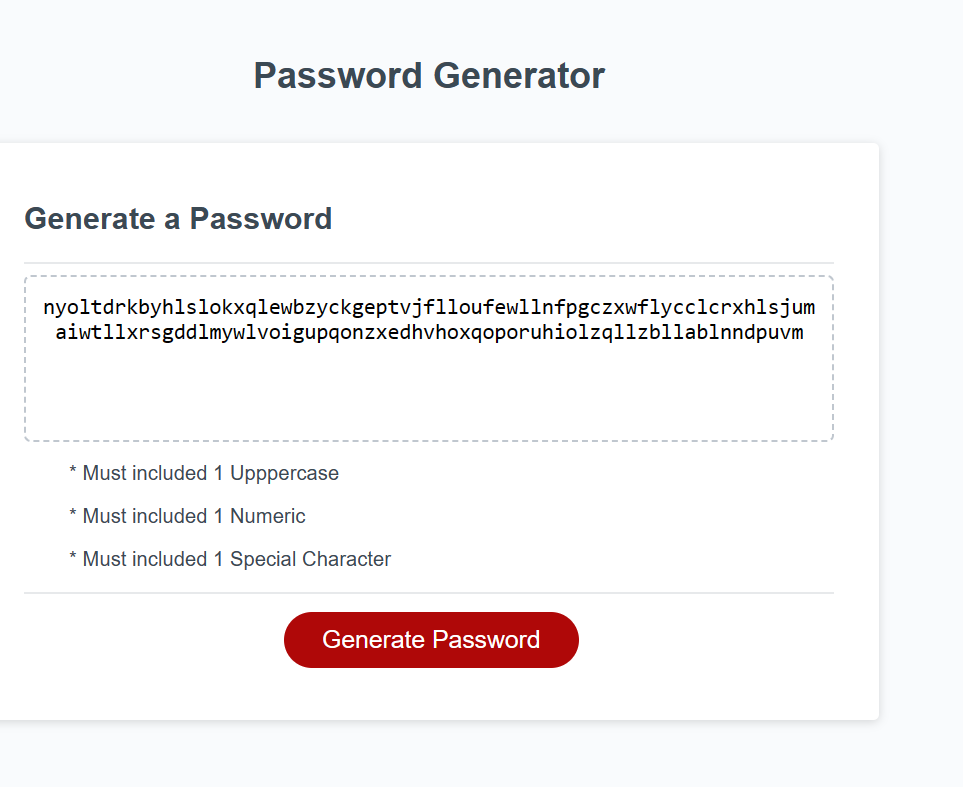

# Password Generator Starter Code

My attempt at modifying existing code to fulfill User Story Requirements.

## Technolgy
.html
.js
.css

## Requirments 

Meet acceptance Criteria below:

Acceptance Criteria
GIVEN I need a new, secure password
WHEN I click the button to generate a password
THEN I am presented with a series of prompts for password criteria
WHEN prompted for password criteria
THEN I select which criteria to include in the password
WHEN prompted for the length of the password
THEN I choose a length of at least 8 characters and no more than 128 characters
WHEN asked for character types to include in the password
THEN I confirm whether or not to include lowercase, uppercase, numeric, and/or special characters
WHEN I answer each prompt
THEN my input should be validated and at least one character type should be selected
WHEN all prompts are answered
THEN a password is generated that matches the selected criteria
WHEN the password is generated
THEN the password is either displayed in an alert or written to the page

Meet Grading Requirments below:

A repository that has code

A repository that includes a unique name 

A repositorythat includes a README file 

A repository that  includes  code other than the starter code

#Operation

I had intentions on when the Generator Password button is clicked to have to generate a password of 8-128 characters. I could not figure out how to limit and add requirements for unique code generated.

##Screenshot

